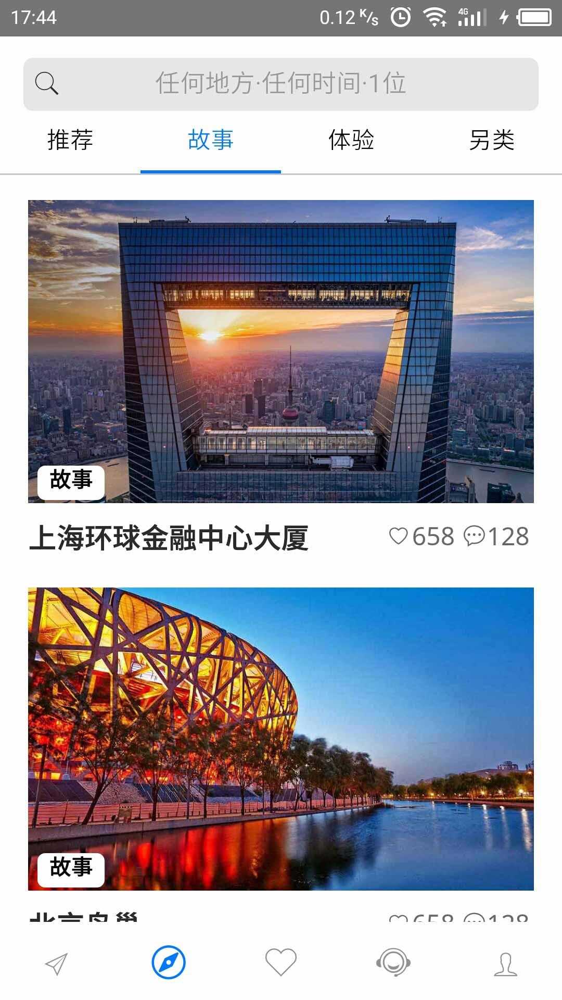
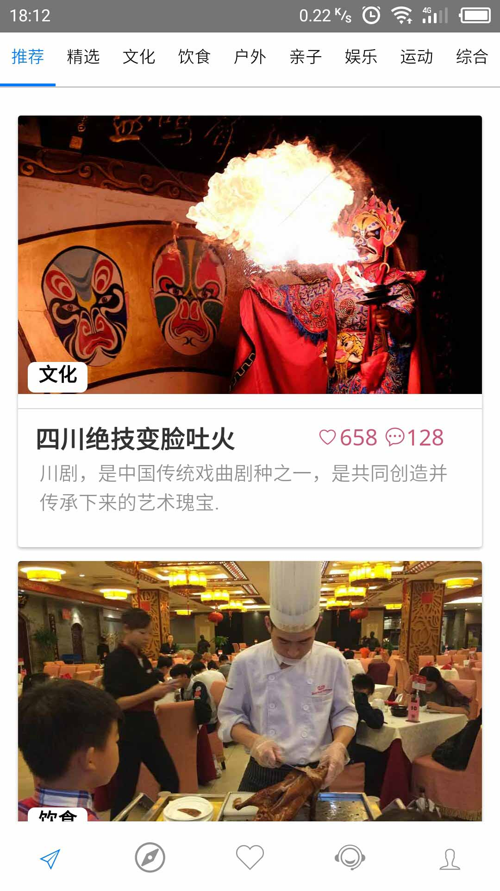
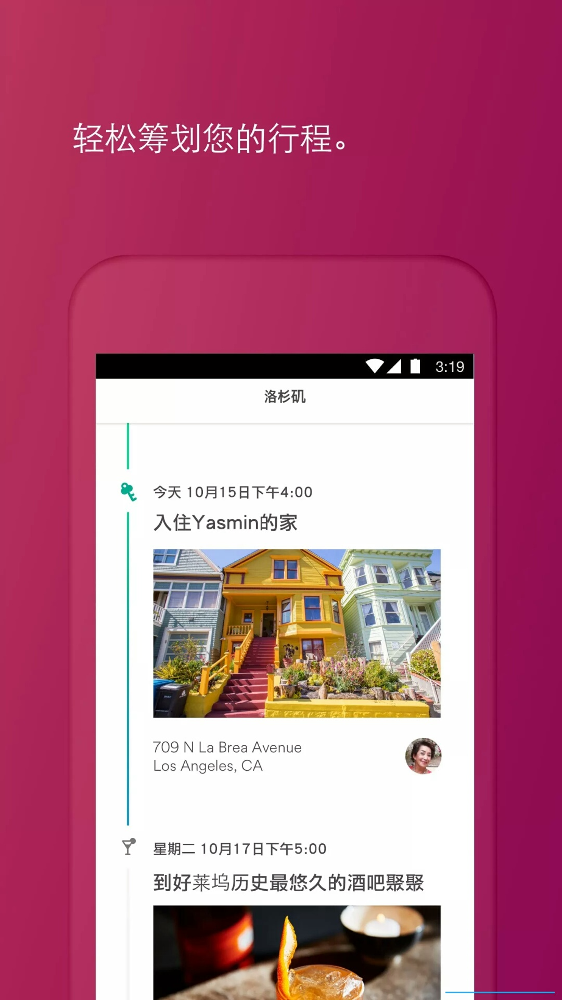
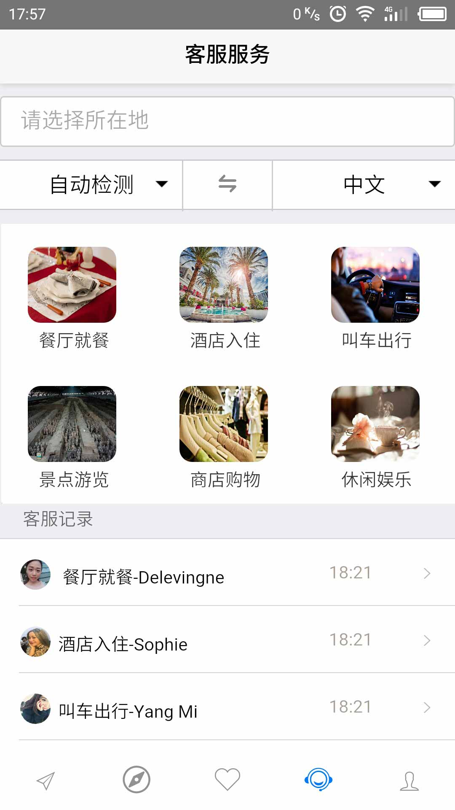


<!DOCTYPE html>
<!--[if lt IE 7]>      <html class="no-js lt-ie9 lt-ie8 lt-ie7"> <![endif]-->
<!--[if IE 7]>         <html class="no-js lt-ie9 lt-ie8"> <![endif]-->
<!--[if IE 8]>         <html class="no-js lt-ie9"> <![endif]-->
<!--[if gt IE 8]><!--> <html class="no-js"> <!--<![endif]-->
	<head>
	<meta charset="utf-8">
	<meta http-equiv="X-UA-Compatible" content="IE=edge">
	<title>dumpling trip下载</title>
	<meta name="viewport" content="width=device-width, initial-scale=1">
	<meta name="description" content="Free HTML5 Website Template by FreeHTML5.co" />
	<meta name="keywords" content="free website templates, free html5, free template, free bootstrap, free website template, html5, css3, mobile first, responsive" />
	
	<!-- Animate.css -->
	<link rel="stylesheet" href="css/animate.css">
	<!-- Icomoon Icon Fonts-->
	<link rel="stylesheet" href="css/icomoon.css">
	<!-- Bootstrap  -->
	<link rel="stylesheet" href="css/bootstrap.css">
	<!-- Theme style  -->
	<link rel="stylesheet" href="css/style.css">

	<!-- Modernizr JS -->
	
	<!-- FOR IE9 below -->
	<!--[if lt IE 9]>
	
	<![endif]-->
	
	</head>
	<body>
	
	<header id="fh5co-header">
		

			

				

					

						入境游
						dumpling  trip
					

					

						难忘的旅程从dumpling  trip开始。不论出门在外或在家附近都能找到探险之旅。获取世界各地独特的体验及好去处的信息，预订旅程所需的一切。
					

					

						<a href="#" class="btn btn-primary btn-down">
							<i class="icon-apple"></i>
							苹果客户端 
							App Store
						</a>
						<a href="#" class="btn btn-primary btn-down">
							<i class="icon-android"></i>
							安卓客户端 
							Google play
						</a>
					

				

			

			

				<figure class="fh5co-intro-img">
					
				</figure>
			

		

	</header>

	

		

			

				

					

						

							<h2>预订体验</h2>
							
不管您是在计划多天还是仅仅一个下午的活动，来参加由当地达人为您打造的旅程体验吧。探索首尔的地下音乐，到托斯卡纳森林寻找松露，或是参加志愿者体验，回馈我们的社区。

						

					

				

				

					

						<figure class="fh5co-figure animate-box">
							
						</figure>
					

				

			

			<!-- END feature -->

			

				

					

						

							<h2>筹划行程</h2>
							<ul class="plan">
								<li>为您的下一趟个人旅行、家庭出行或商务差旅预订房源和体验</li>
								<li>寻找最后一刻的住宿或长期住宿选择</li>
								<li>将您最爱的特色房源、体验和好去处保存下来，邀请朋友或家人一起筹划旅程</li>
								<li> 将体验和活动添加到您的行程中</li>
							</ul>						
						

					

				

				

					

						<figure class="fh5co-figure animate-box">
							
						</figure>
					

				

			

			<!-- END feature -->

			

				

					

						

							<h2>更贴身的人工服务</h2>
							
让外国游客可以随时随地的与人沟通

						

					

				

				

					

						<figure class="fh5co-figure animate-box">
							
						</figure>
					

				

			

			<!-- END feature -->

		
		

		<footer id="footer">
			

				

					

						<small>&copy; 2017 版权所有武汉闻风多奇软件有限责任公司</small>
					

				

			

		</footer>
	

	
	<!-- jQuery -->
	
	<!-- jQuery Easing -->
	
	<!-- Bootstrap -->
	
	<!-- Waypoints -->
	
	<!-- Carousel -->
	

	<!-- MAIN JS -->
	

	</body>
</html>

